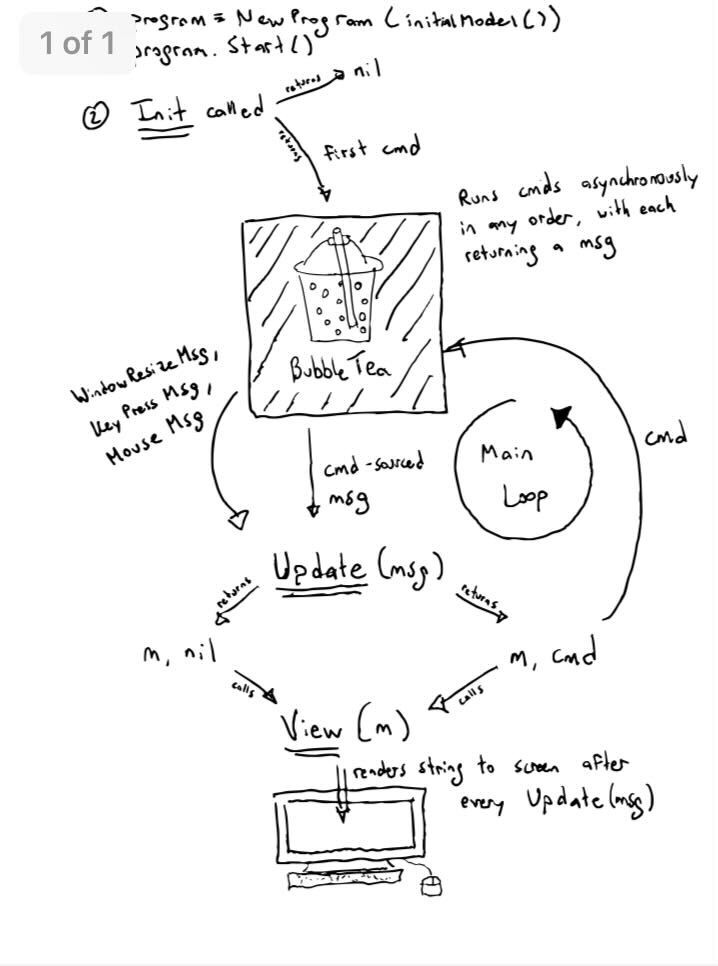

# Bubble teasers

[starter](cmd/starter): A starter template that separates the `tea.MouseMsg`- and `tea.KeyMsg`'s in separate handler-methods (not necessarily something you would want to do but in this case it serves an educational purpose). Run with `go run cmd/starter/main.go`. Try **pressing keys**, **moving mouse** and **resizing terminal window**.

> Please add more *teasers*!

# TUI's with Bubble Tea

The framework: https://github.com/charmbracelet/bubbletea

Components: https://github.com/charmbracelet/bubbles

The Bubble Tea framework is modelled after [The Elm Architecture](https://guide.elm-lang.org/architecture/)

Image source: the Charm Slack (https://charmbracelet.slack.com)
