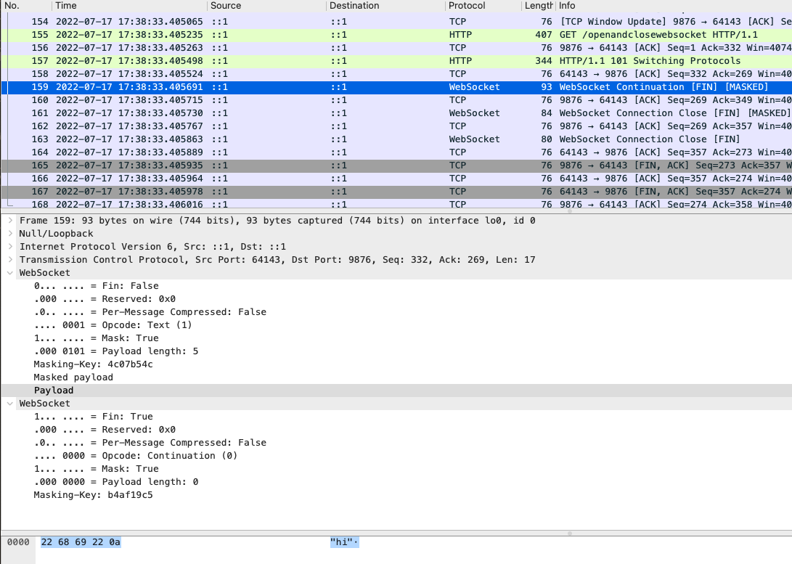

# Introduction

In this example we try an alternative websocket-implementation:
https://github.com/nhooyr/websocket (check there to see more differences with
gorilla's and others)

For this example, we simply want to measure latency and it seems this library
already provides it:

From the docs at https://pkg.go.dev/nhooyr.io/websocket#Conn.Ping:

> Ping sends a ping to the peer and waits for a pong. Use this to measure
> latency or ensure the peer is responsive. Ping must be called concurrently
> with Reader as it does not read from the connection but instead waits for a
> Reader call to read the pong.

> TCP Keepalives should suffice for most use cases.

# TODO

- [x] A simple custom http-server without a mux
- [x] Separate server in separate cmd (run with `go run cmd/wsppsrv/main.go`)
- [x] Client app for easy testing (run with `go run cmd/wsppclient/main.go`) 
- [x] Upgrade client-connections to websocket-connections (`/openandclosewebsocket`-route)
- [ ] Store all connected clients and show them all on page refresh
- [ ] Add a bubbletea-TUI
- [ ] ...

# Specs

## no mux

It might be a bit contrarian but this example doesn't use a **mux** or `HandleFunc`'s.
We want to focus on websocket-protocol-specifics so we just use `r.URL.String()` to check the `URL` in the `http.Request`.

## custom server

We create a custom `net/http`-server in stead of using the default
`http.ListenAndServe(...)` because (according to *Jon Bodner - Learning
Go, page 251*):

- other libraries might use these `http`-package-level-variables already and
  interfere
- we can then set our own timeouts and custom configuration (like middleware)

## block favicon

It just pollutes our logging?

# Testing with wireshark

Workflow:

- start wireshark with sufficient privileges (and perhaps install a capture-driver) to **capture packets on the local loopback interface**
- `go run cmd/wsppsrv/main.go`
- `go run cmd/wsppclient/main.go` and choose a request to send
- explore the packets in wireshark:

